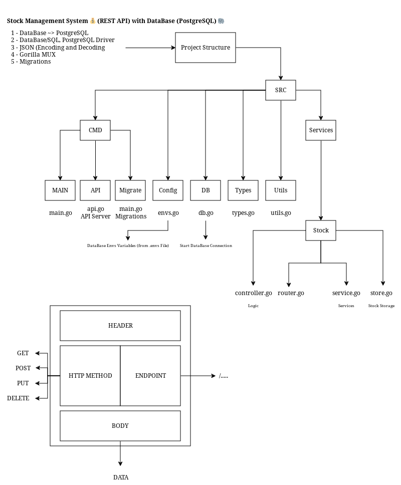

# stock-go-sql-rest-api

Stock Management System 💰 (REST API) with DataBase (PostgreSQL) 🐘

⚠️ **NOTE!!!!!** This Goalng App Written for Me - So some Things Might not Work on Your PC or Laptop as this was Never Intended to be a Usable Full Fledged Application, in that Case, Please Try if You Can Fix that Up as Much as Possible, or you can Open an Issue for Help :) - You Need to Change Something Related to Database (in Makefile, docker-compose.yml and ...) - So Please Check Everything Before Running the Database and Server.



## Requirements

- make
- Create a Docker Network to Connect Golang Server Container and MariaDB Container with Each other
- [PostgreSQL](https://www.postgresql.org/)
- [PostgreSQL Docker Image](https://hub.docker.com/_/postgres)
- [Migrate (for DB Migrations)](https://github.com/golang-migrate/migrate/tree/v4.17.0/cmd/migrate)

## Makefile

A Standard GNU Make File is Provided to Help with Running and Building Locally.

```text
help                 💬 This Help Message
lint                 🔎 Lint & Format, will not Fix but Sets Exit Code on Error
lint-fix             📜 Lint & Format, will Try to Fix Errors and Modify Code
migrate-up           🔺 Database Migrations - Create a Required Tables in Database (ecom)
migrate-down         🔻 Database Migrations - Drop a Tables in Database (ecom)
build                🔨 Build Binary File
run                  >_ Run the Web Server Locally at PORT 9010
init                 📥 Download Dependencies From go.mod File
clean                🧹 Clean up Project
postgres             🐘 Pull PostgreSQL Docker Image from Docker Hub Registry
docker-network       🪡 Create Docker Network
image                📦 Build Docker Container Image from Dockerfile
push                 📤 Push Container Image to Registry
compose-up           🧷 Create and Start Containers
compose-down         🧼 Stop and Remove Containers, Networks
```

Makefile Variables

| Makefile Variable | Default                          |
| ----------------- | -------------------------------- |
| SRC_DIR           | ./src/                           |
| DEFAULT_GOAL      | help                             |
| BINARY_NAME       | main                             |
| BINARY_DIR        | ./bin/                           |
| IMAGE_REPO        | soelz/stock-go-sql-rest-api      |
| IMAGE_TAG         | 0.1                              |
| DATABASE_URL      | postgres://sz:1234@db:5432/stock |
| PostgreSQL_IMAGE  | postgres:alpine3.18              |

## Containers

RUN Server in a Container

```bash
docker run --name db --network backend -e POSTGRES_USER=sz -e POSTGRES_PASSWORD=1234 -e POSTGRES_DB=stock -p 5432:5432 postgres:alpine3.18
```

```bash
docker run --network backend -p 9010:9010 soelz/stock-go-sql-rest-api:0.1
```

OR

Just Execute this Command ~>

```bash
make compose-up
```

<br></br>
